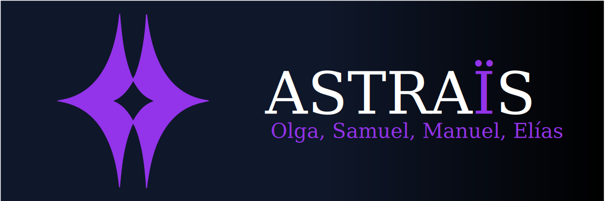
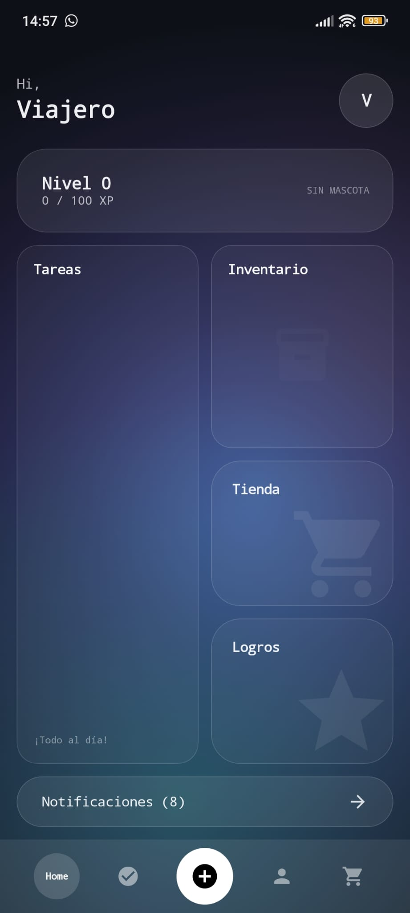

<div align="center">

# Proyecto final: Astraïs



[](https://kotlinlang.org/)
[](https://kotlinlang.org/)
[](https://react.dev/)
[](https://developer.android.com/)
[](https://www.postgresql.org/)
[](https://ktor.io/)

> **Convierte tu productividad en una aventura** <br />
> Sistema de gamificación para hábitos y tareas con progresión de personaje, recompensas y colaboración social.

<br />

<a href="#"></a>
<a href="#"></a>
<a href="./API.md"></a>
<a href="https://github.com/GrupoAstrais/proyectoAstrais/issues"></a>

</div>

---

## Sobre el Proyecto
 
Astraïs resuelve uno de los mayores obstáculos para mantener la productividad personal: la falta de constancia. Transforma tareas cotidianas en una experiencia gamificada donde los usuarios pueden:
 
- **Gestionar tareas** personales y grupales con seguimiento visual
- **Subir de nivel** mediante experiencia (XP) acumulada
- **Comprar cosméticos** con Ludiones (moneda virtual)
- **Colaborar en grupos** con roles definidos
- **Acceder a minijuegos** como recompensa
- **Personalizar avatar** y adoptar mascotas
 
### Problema que resuelve:
- Falta de motivación inmediata en sistemas tradicionales
- Monotonía en rutinas repetitivas
- Ausencia de refuerzo positivo visible
- Dificultad para compartir objetivos colaborativamente

## Capturas de Pantalla

### Interfaz Principal


### Gestión de Tareas


### Sistema de Grupos


### Tienda de Cosméticos


## Características Principales

### Implementadas:
- Autenticación segura (JWT + OAuth Google)
- Gestión completa de tareas
- Sistema de grupos colaborativos
- Tienda virtual con cosméticos
- Sistema de niveles y XP
- Personalización de avatar

### En Desarrollo:
- Sistema de logros y achievements
- Minijuegos integrados
- Sistema de amigos
- Notificaciones push
- Rachas avanzadas
- Eventos en tiempo real mediante SSE

## Stack Tecnológico

### Backend

- **Kotlin**
- **Ktor**
- **Exposed ORM**
- **PostgreSQL**
- **JWT**
- **Docker**

El backend está desarrollado con Ktor sobre Kotlin/JVM. Expone una API REST con autenticación JWT, OAuth con Google, gestión de usuarios, tareas, grupos, tienda, inventario, recompensas y comunicación con PostgreSQL mediante Exposed ORM.

### Aplicación Web

- **React**
- **TypeScript**
- **Vite**
- **Tailwind CSS**
- **React Router**
- **Axios**

La aplicación web está desarrollada con React, TypeScript y Vite. Utiliza Tailwind CSS para estilos, React Router para navegación y Axios para la comunicación con el backend.
 
### Aplicación Android

- **Kotlin**
- **Jetpack Compose**
- **Ktor Client**
- **Room**
- **DataStore**
- **Hilt**

La aplicación Android está desarrollada en Kotlin con Jetpack Compose. Sigue una arquitectura basada en estado, cliente Ktor para comunicación con la API, Room para persistencia local, DataStore para preferencias y Hilt para inyección de dependencias.


### Infraestructura

- **Docker**
- **Docker Compose**
- **PostgreSQL 17**
- **Nginx**

El proyecto incluye un `docker-compose.yml` con servicios para backend y base de datos. PostgreSQL se ejecuta en contenedor con volumen persistente y el backend se construye mediante un Dockerfile basado en Gradle y Eclipse Temurin.

## Estructura del Proyecto

```text
proyectoAstrais/
├── backend/              
├── astrais-web/          
├── AstraisAndroid/       
├── docker/               
├── HojaDeEstilos/        
├── docs/                 
├── API.md                
├── MANUAL_DE_USUARIO_ASTRAIS.md
├── docker-compose.yml    
└── README.md             
```

### Componentes principales
- **backend/**: contiene el servidor desarrollado con Ktor, las rutas de la API, la lógica de autenticación, grupos, tareas, tienda, inventario y acceso a base de datos.
- **astrais-web/**: contiene la aplicación web desarrollada con React, TypeScript y Vite.
- **AstraisAndroid/**: contiene la aplicación móvil Android desarrollada con Kotlin y Jetpack Compose.
- **docker/**: contiene los Dockerfiles usados para construir los servicios del proyecto.
- **HojaDeEstilos/**: contiene el prototipo visual, guía de estilos y recursos de identidad corporativa.
- **API.md**: contiene la documentación completa de endpoints del backend.
- **MANUAL_DE_USUARIO_ASTRAIS.md**: contiene la guía de uso de la aplicación.

## Instalación y Ejecución

### Requisitos previos

Antes de ejecutar el proyecto, es necesario tener instalado:

- **Git**
- **Docker**
- **Docker Compose**
- **Node.js**
- **npm**
- **JDK 21**
- **Android Studio** para ejecutar la aplicación Android

### Clonar el repositorio

```bash
git clone https://github.com/GrupoAstrais/proyectoAstrais.git
cd proyectoAstrais
```

### Configurar variables de entorno

El backend y la base de datos utilizan variables de entorno definidas en un archivo `.env`.

El proyecto debe incluir un archivo `.env` en la raíz con los siguientes valores:

```env
DB_USER=
DB_PASSWORD=
DB_NAME=
KTOR_PORT=
JWT_ISSUER=
JWT_AUDIENCE=
JWT_SECRET_ACCESS=
JWT_SECRET_REFRESH=
GOOGLE_CLIENT_ID=
GOOGLE_SECRET_ID=
```

### Ejecutar backend y base de datos con Docker

Desde la raíz del proyecto:

```bash
docker compose up --build
```

Esto levantará:

- Base de datos PostgreSQL
- Backend Ktor

### Ejecutar la aplicación web

```bash
cd astrais-web
npm install
npm run dev
```

La aplicación web se ejecutará en el puerto indicado por Vite.

### Ejecutar la aplicación Android

Para ejecutar la aplicación Android:

1. Abrir la carpeta `AstraisAndroid/` en Android Studio.
2. Sincronizar el proyecto con Gradle.
3. Configurar las variables necesarias en `local.properties`.
4. Ejecutar la aplicación en un emulador o dispositivo físico.

## Documentación

El proyecto incluye varios documentos de apoyo para entender tanto el desarrollo como el uso de la aplicación:

- **API.md**: documentación técnica de los endpoints del backend.
- **MANUAL_DE_USUARIO_ASTRAIS.md**: manual de usuario con explicación de las pantallas y funcionalidades.
- **Documentacion_Astrais.pdf**: documentación general del proyecto intermodular.
- **HojaDeEstilos/**: guía visual, prototipo e identidad corporativa del proyecto.

## API

La API del backend está organizada en diferentes módulos funcionales:

- **Auth**: registro, inicio de sesión, verificación de cuenta, OAuth con Google, regeneración de tokens y gestión del usuario autenticado.
- **Groups**: creación de grupos, gestión de miembros, roles, invitaciones, auditoría y transferencia de propiedad.
- **Tasks**: creación, edición, eliminación, completado y descompletado de tareas individuales, hábitos y objetivos.
- **Store**: consulta de cosméticos, compra de artículos, inventario y equipamiento.
- **Admin**: gestión administrativa de usuarios, catálogo de cosméticos y configuración de la tienda.

La documentación completa de endpoints, cuerpos de petición, respuestas y códigos de error se encuentra en [`API.md`](./API.md).

## Modelo de Base de Datos

El modelo de datos está basado en PostgreSQL y se define desde el backend mediante Exposed ORM.

### Entidades principales

- **Users**: almacena los usuarios, datos de perfil, rol, experiencia, nivel, ludiones, rachas y configuración visual.
- **AuthCredentials**: gestiona credenciales externas asociadas a proveedores OAuth.
- **UserConfirm**: almacena códigos de confirmación para la verificación de cuentas.
- **Group**: representa los grupos de trabajo y colaboración.
- **RelGroupUser**: relaciona usuarios con grupos y define el rol de cada miembro.
- **GroupInvite**: gestiona invitaciones seguras mediante códigos y enlaces.
- **GroupAuditLog**: almacena eventos relevantes ocurridos dentro de un grupo.
- **Task**: almacena las tareas generales.
- **TaskUnique**: contiene datos específicos de tareas únicas.
- **TaskHabit**: contiene datos específicos de hábitos y rachas.
- **TaskObjective**: contiene datos específicos de objetivos.
- **Cosmetic**: almacena los cosméticos disponibles en la tienda.
- **Inventory**: relaciona usuarios con cosméticos adquiridos.
- **Awards**: define la base para el sistema de logros.

```markdown

```

## Estado del Proyecto

| Funcionalidad | Estado | Observaciones |
|---|---|---|
| Autenticación con JWT | Implementado | Incluye registro, login, verificación y regeneración de token |
| OAuth con Google | Implementado | Soporte para web y Android |
| Gestión de usuarios | Implementado | Perfil, edición de datos y eliminación |
| Gestión de tareas | Implementado | Tareas únicas, hábitos, objetivos, completar y descompletar |
| Sistema de grupos | Implementado | Miembros, roles, invitaciones y auditoría |
| Tienda e inventario | Parcial | Compra, catálogo e inventario implementados; ampliable con eventos y rarezas avanzadas |
| Sistema de niveles y recompensas | Parcial | XP y ludiones implementados; falta ampliar bonificaciones y logros |
| Logros | Parcial | Existe base de datos, falta lógica completa de desbloqueo |
| Minijuegos | Parcial | Existe una base inicial, falta integración completa con recompensas |
| Sistema de amigos | Pendiente | No implementado |
| Notificaciones | Pendiente | No implementado |
| Rachas avanzadas | Pendiente | Solo existen rachas básicas relacionadas con hábitos |

## Despliegue

Esta parte hay que hacerla compis

## Trabajo Futuro

Las principales líneas de mejora previstas son:

- Implementar sistema de amigos.
- Completar sistema de logros con desbloqueo automático.
- Ampliar minijuegos e integrarlos con recompensas.
- Implementar notificaciones.
- Mejorar sistema de rachas y bonificaciones.
- Añadir eventos temporales para la tienda.
- Completar despliegue en Proxmox.
- Añadir más pruebas automatizadas.

## Equipo de Desarrollo

Proyecto desarrollado por:

- **Olga**
- **Samuel**
- **Manuel**
- **Elías (Ahora desde PopOS)**


