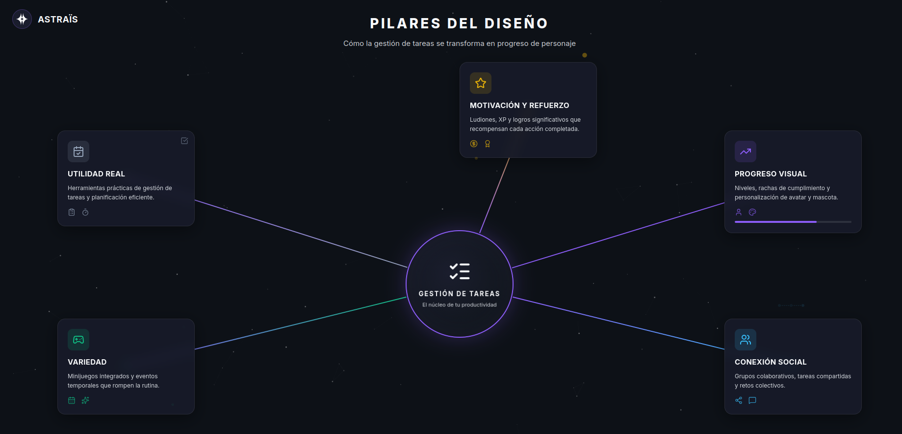
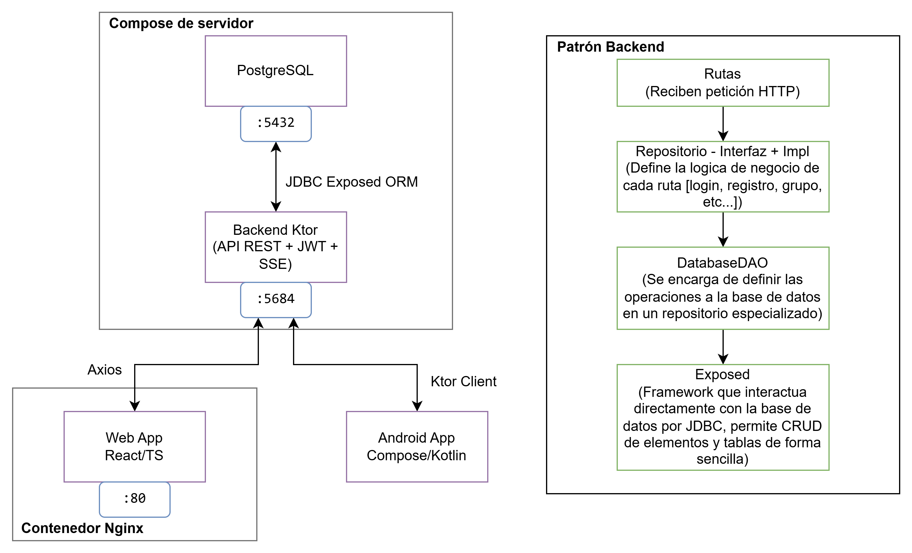
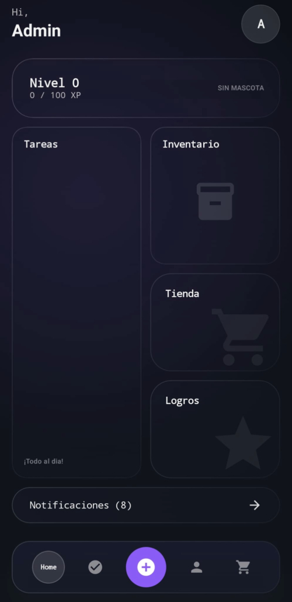
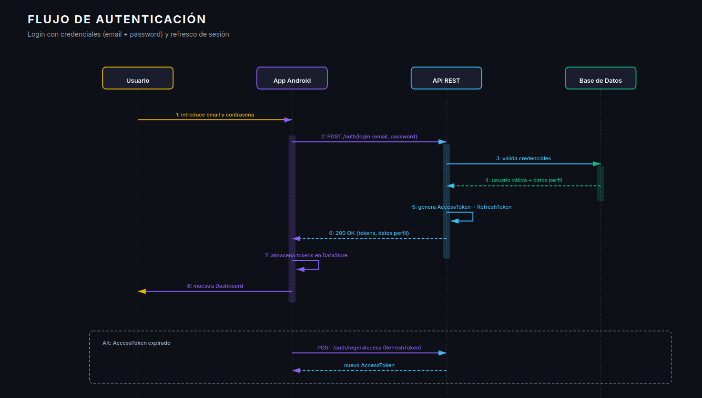
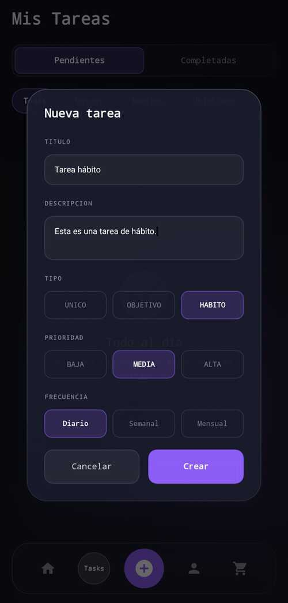
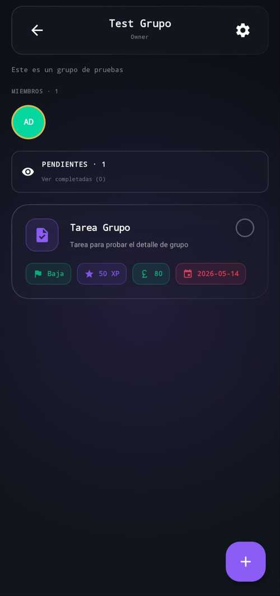
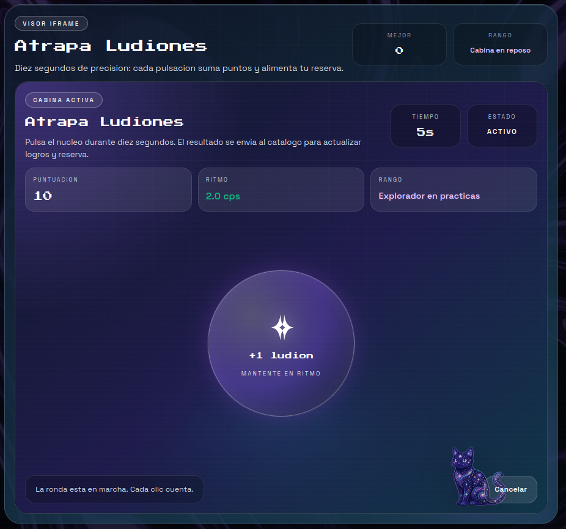
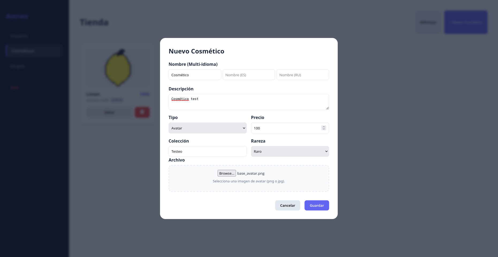
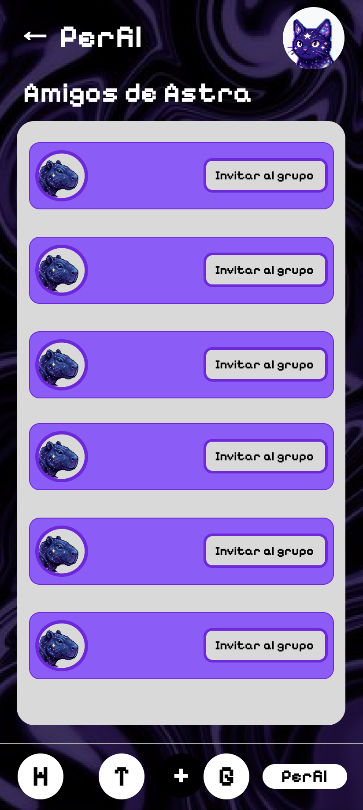

# Documentación — Proyecto Astraïs

**Proyecto Intermodular de Desarrollo de Aplicaciones Multiplataforma (DAM)**  
**Equipo de desarrollo:** Olga, Samuel, Manuel y Elías  


---

## Tabla de Contenidos

1. [Descripción y justificación del proyecto](#1-descripción-y-justificación-del-proyecto)
2. [Valoración de mercado](#2-valoración-de-mercado)
3. [Stack tecnológico elegido](#3-stack-tecnológico-elegido)
4. [Objetivos del proyecto](#4-objetivos-del-proyecto)
5. [Requisitos del sistema](#5-requisitos-del-sistema)
6. [Casos de uso](#6-casos-de-uso)
7. [Modelo y diseño de Base de Datos](#7-modelo-y-diseño-de-base-de-datos)
8. [Lógica de negocio](#8-lógica-de-negocio)
9. [Planificación y gestión](#9-planificación-y-gestión)
10. [Diseño y prototipado](#10-diseño-y-prototipado)
11. [Arquitectura del Sistema](#11-arquitectura-del-sistema)
12. [Estructura del Proyecto](#12-estructura-del-proyecto)
13. [Instrucciones de Despliegue e Instalación](#13-instrucciones-de-despliegue-e-instalación)
14. [Futuras implementaciones](#14-futuras-implementaciones)

---

## 1. Descripción y justificación del proyecto

### 1.1. Problema real y contexto

Uno de los mayores obstáculos para mantener la productividad personal es la falta de constancia. Aunque muchas personas tratan de usar sistemas de organización (listas, calendarios, apps), suelen abandonarlos en poco tiempo debido a:

- **La falta de motivación inmediata**, porque no perciben recompensas visibles tras completar actividades.
- **La sensación de monotonía** por rutinas repetitivas.
- **La ausencia de refuerzo positivo visible** que refuerce el avance personal.
- **La dificultad para compartir objetivos** de forma colaborativa.

### 1.2. Propuesta de valor

Astraïs propone resolver este problema mediante la **gamificación de hábitos y tareas cotidianas**, transformando la rutina en una experiencia interactiva inspirada en videojuegos: progresión por niveles, desbloqueo de logros, moneda virtual, tienda de recompensas, minijuegos integrados y opciones de personalización. De este modo, convierte lo ordinario en algo más especial para fomentar la constancia a largo plazo.

Astraïs convierte la productividad en un **"progreso de personaje"**. Más allá de gestionar tareas, el usuario puede notar crecimiento continuo: sube de nivel, desbloquea cosméticos, personaliza su avatar, adopta mascotas y accede a minijuegos. Además, está diseñado para evitar el famoso **P2W (pay to win)**: el avance (nivel, logros) se obtiene mediante esfuerzo y constancia, no mediante pagos.

**Pilares fundamentales del diseño:**

- **Motivación y refuerzo:** sistema de recompensas inmediatas mediante Ludiones (moneda virtual), puntos de experiencia (XP) y logros significativos.
- **Progreso tangible y visual:** avance medible a través de niveles, rachas de cumplimiento y opciones de personalización.
- **Conexión social:** interacción mediante amigos, grupos colaborativos, tareas compartidas y retos colectivos.
- **Variedad:** minijuegos y eventos temporales que rompen la repetición diaria, manteniendo la aplicación activa sin sacrificar el foco en el objetivo real (productividad personal).
- **Utilidad real:** base de herramientas prácticas (gestión de tareas y planificación).



### 1.3. Alcance

**Alcance inicial:**

- **Gestión de tareas:** sistema completo para tareas individuales y grupales, con asignación de responsabilidades, plazos y seguimiento.
- **Colaboración en equipo:** grupos con gestión de miembros, roles diferenciados (Owner, Moderador, Miembro) y tareas compartidas.
- **Economía virtual:** moneda interna (Ludiones) obtenida mediante el cumplimiento de tareas.
- **Personalización:** tienda integrada para adquirir cosméticos, personalización del avatar y sistema de mascotas.
- **Progresión:** sistema de niveles basado en XP acumulada, rachas de cumplimiento y logros.
- **Interacción social:** sistema de invitaciones a grupos y compartir tareas (sistema de amigos en desarrollo).
- **Entretenimiento:** minijuegos breves y eventos puntuales cuyo acceso y recompensas están directamente vinculados al rendimiento productivo real.
- **Plataformas:** App móvil (Android) + App Web de apoyo/administración/consulta.

**Fuera de alcance inicial (para fases futuras):**

- Inteligencia artificial para planificación autónoma, sugerencia de prioridades o distribución inteligente de tareas.
- Integración con Google Calendar / Outlook / Apple Calendar.
- Marketplace de skins creadas por usuarios.

---

## 2. Valoración de mercado

### 2.1. Habitica

**Pros:** gamificación completa y probada, comunidad activa de millones de usuarios, misiones cooperativas (aunque no son tareas propiamente dichas).

**Contras:** interfaz visual sobrecargada con curva de aprendizaje pronunciada para nuevos usuarios; estética retro (puede ser poco atractiva para personas no acostumbradas); personalización estática sin evolución (cosméticos planos, sin mascotas interactivas ni sistema de colección con rareza); más enfocada en gamificación que en utilidad pura.

**Oportunidad para Astraïs:** experiencia visual limpia y moderna (Jetpack Compose / Tailwind CSS), minijuegos que no comprometen la productividad, mascotas y cosméticos coleccionables con niveles de rareza, y una interfaz declarativa reactiva que reduce la curva de aprendizaje.

### 2.2. Skillion / Motion / Eterya (apps de motivación gamificada)

**Pros:** diseño visual minimalista, gamificación ligera que facilita la entrada a la app mediante hábitos y rutinas simples.

**Contras:** economía virtual superficial, interacción social limitada a compartir logros sin colaboración real, experiencia repetitiva tras las primeras semanas, más enfocadas en gamificación que en utilidad real de gestión.

**Oportunidad para Astraïs:** ser un híbrido entre productividad funcional y juego social. Se conserva la elegancia visual de estas apps, pero se añade profundidad mediante economía interna (Ludiones + tienda + transacciones), colaboración en equipos con roles definidos, minijuegos breves y un backend propio que garantiza control total sobre la evolución del sistema.


---

## 3. Stack tecnológico elegido

### 3.1. Backend (Servidor)

| Tecnología | Versión | Propósito y justificación |
|---|---|---|
| **Kotlin** | 2.1.0 | Lenguaje de alto nivel, conciso y seguro contra nulos. Permite servidores ligeros y modulares con la flexibilidad de transpilación JVM, aprovechando optimización a código máquina. |
| **Ktor** | 3.1.3 | Framework asíncrono para API REST y SSE. Deja hacer servidores de alto rendimiento ligeros y modulares con la flexibilidad de un lenguaje de alto nivel como Kotlin. |
| **Exposed ORM** | 1.0.0 | ORM con flexibilidad para trabajar con varios tipos de base de datos relacionales (PostgreSQL, MySQL, SQLite, Oracle) usando el mismo código, brindando flexibilidad considerable si se decidiera migrar. |
| **PostgreSQL** | 17 | Sistema de gestión de bases de datos relacionales orientadas a objetos avanzado y de código abierto, robusto y con tipos de datos avanzados (JSON/JSONB) que permiten la creación de extensiones. |
| **JWT (Auth0)** | — | Autenticación stateless con AccessToken de corta duración y RefreshToken de larga duración. |
| **OAuth 2.0 (Google)** | — | Login y registro federado para Web y Android. |
| **BCrypt** | 0.10.2 | Hash seguro de contraseñas con manejo automático de salts y coste de trabajo (límite de 72 bytes). |
| **Docker + Docker Compose** | — | Portabilidad, fácil escalación y despliegue ligero mediante contenedores. |
| **Netty** | — | Motor de servidor embebido para Ktor. |
| **Logback** | — | Logging estructurado del servidor. |

El backend sigue una arquitectura modular por dominio: `auth`, `groups`, `tasks`, `admin`, `avatar`, `store` y `SSE`. Cada módulo encapsula sus rutas, repositorios y tipos de serialización.

### 3.2. App móvil (Android)

| Tecnología | Versión | Propósito y justificación |
|---|---|---|
| **Kotlin** | 2.0.21 | Lenguaje moderno, conciso y seguro contra errores nulos, ideal para código mantenible y robusto en Android. |
| **Jetpack Compose** | BOM 2026.02.00 | UI declarativa que acelera el desarrollo de pantallas complejas como tienda, logros, avatar o listas dinámicas de grupos. Componentes reutilizables y reactivos que se actualizan automáticamente ante cambios de estado. |
| **Ktor Client** | 3.1.3 | Cliente HTTP con autenticación Bearer automática y refresh de tokens transparente. |
| **Room** | 2.6.1 | Persistencia local SQLite para tareas, grupos y acciones pendientes en modo offline. |
| **DataStore Preferences** | 1.2.1 | Almacenamiento seguro de tokens JWT y preferencias de sesión. |
| **Hilt** | 2.51.1 | Inyección de dependencias en tiempo de compilación para facilitar testing y escalabilidad. |
| **WorkManager** | 2.9.0 | Sincronización periódica en segundo plano de acciones offline. |
| **Lottie Compose** | 6.4.0 | Renderizado de animaciones vectoriales para mascotas y cosméticos. |
| **Security Crypto** | 1.1.0 | Cifrado de preferencias sensibles. |
| **Google Credentials / Google ID** | 1.1.0 - 1.2.1 | OAuth nativo en Android con Google Sign-In. |

La arquitectura de la app se basa en el patrón **MVVM** con separación en capas:
- `data`: API (Ktor), base de datos local (Room), preferencias (DataStore) y repositorios.
- `ui`: pantallas (Compose), ViewModels, componentes reutilizables y tema visual.
- `di`: módulos de Hilt para proveer dependencias.
- `sync`: Worker de sincronización offline (`SyncWorker`) y scheduler (`ScheduleSync`).

### 3.3. App web

| Tecnología | Versión | Propósito y justificación |
|---|---|---|
| **React** | 19.2.0 | Biblioteca principal de interfaz de usuario. Arquitectura modular que facilita mantenimiento y escalabilidad. |
| **TypeScript** | ~5.9.3 | Tipado estático que previene errores en tiempo de desarrollo, mejora autocompletado y refactorización segura. |
| **Vite** | 7.3.1 | Configuración simple y velocidad desde el primer segundo. Soporte nativo para TypeScript sin necesidad de plugins adicionales. |
| **Tailwind CSS** | 4.2.1 | Framework de utilidades CSS para diseño rápido, unificado y responsivo con elementos predefinidos (colores, tipografía). |
| **React Router DOM** | 7.14.0 | Enrutamiento declarativo del SPA. |
| **Axios** | 1.13.6 | Cliente HTTP para consumo de la API REST. |
| **Liquid Glass (React)** | 0.1.3 / 1.0.2 | Componentes visuales con estética de cristal líquido para enriquecer la UI. |

### 3.4. Infraestructura

| Tecnología | Propósito |
|---|---|
| **Docker + Docker Compose** | Orquestación de PostgreSQL y Backend con healthchecks y volúmenes persistentes. |
| **Nginx** (planeado) | Proxy inverso, terminación SSL y servicio de assets estáticos. |
| **Gradle** | Build system del backend (fat JAR) y de Android. |
| **Proxmox** (planeado) | Plataforma de despliegue en producción. |



---

## 4. Objetivos del proyecto

### 4.1. Objetivo general

Desarrollar una solución multiplataforma (app móvil Android + web) que mejore la constancia de los usuarios en la gestión de tareas mediante gamificación, motivación progresiva, recompensas tangibles y colaboración social.

### 4.2. Objetivos específicos

1. Permitir crear, editar y completar tareas personales y grupales con asignación de fechas, prioridades y seguimiento visual del progreso.
2. Implementar XP por tareas completadas y Ludiones por rachas y logros, con conversión automática y visualización en tiempo real.
3. Implementar niveles, logros y tienda con cosméticos coleccionables (avatar, mascota, temas).
4. Implementar perfiles con avatar y mascota equipables.
5. Gestionar grupos (hasta 10 miembros), enviar invitaciones y asignar tareas compartidas con notificaciones.
6. Implementar minijuegos conectados a progresión.
7. Garantizar autenticación segura con roles diferenciados (admin / usuario / invitado).
8. Proveer un backend desplegable con Docker.

---

## 5. Requisitos del sistema

### 5.1. Requisitos Funcionales (RF)

#### Autenticación y cuentas

| ID | Requisito | Estado | Observaciones técnicas |
|---|---|---|---|
| RF-01 | Registro de usuario con validación de correo | Cumplido | Verificación por código de 6 dígitos enviado por email |
| RF-02 | Inicio/cierre de sesión seguros con persistencia controlada | Cumplido | Generación dual de JWT (Access + Refresh) |
| RF-03 | Recuperación y cambio de contraseña mediante enlace temporal | Pendiente | No implementado en la versión actual |
| RF-04 | Edición completa de perfil: nombre, biografía, avatar y mascota | Parcial | Edición de nombre, idioma y UTC implementada; biografía no implementada |
| RF-05 | Gestión de roles con permisos diferenciados (admin, usuario, invitado) | Cumplido | `UserRoles.NORMAL_USER` / `ADMIN_USER`; modo invitado offline en Android |

#### Tareas y calendario

| ID | Requisito | Estado | Observaciones técnicas |
|---|---|---|---|
| RF-10 | Crear, editar y eliminar tareas con estado dinámico | Cumplido | Estados: ACTIVE, COMPLETE, DUE |
| RF-11 | Marcar tareas como completadas/pendientes | Cumplido | Transacciones atómicas de XP/Ludiones con posibilidad de descompletar |
| RF-12 | Asignar fecha límite, prioridad (baja/media/alta), etiquetas y recordatorios | Parcial | Prioridad numérica implementada; etiquetas y recordatorios no implementados |
| RF-13 | Vista calendario (día/semana/mes) | Pendiente | No implementado |
| RF-14 | Crear y gestionar tareas grupales con asignación específica a miembros | Parcial | Tareas grupales implementadas; asignación específica a un único miembro no implementada |

#### Gamificación

| ID | Requisito | Estado | Observaciones técnicas |
|---|---|---|---|
| RF-20 | Sistema de XP y niveles | Cumplido | Fórmula: `(nivel + 1) × 100` XP para subir |
| RF-21 | Otorgamiento de Ludiones por tareas completadas, retos y rachas | Parcial | Ludiones por tareas implementados con límite diario; retos no implementados |
| RF-22 | Logros con desbloqueo automático y exhibición en perfil | Parcial | Esquema de BD (`Awards`) creado; falta lógica de desbloqueo automático. Exhibición estática en web |
| RF-23 | Seguimiento de rachas con recompensas | Parcial | Rachas de hábitos implementadas; rachas de login y bonificaciones avanzadas no implementadas |

#### Economía virtual y tienda

| ID | Requisito | Estado | Observaciones técnicas |
|---|---|---|---|
| RF-30 | Monedero con saldo visible de Ludiones e historial de transacciones | Parcial | Saldo visible implementado; historial de transacciones no implementado |
| RF-31 | Tienda con catálogo organizado de cosméticos por categoría y rareza | Cumplido | Filtros por tipo: PET, APP_THEME, AVATAR_PART; rarezas: COMUN, RARO, EPICO, LEGENDARIO |
| RF-32 | Compra de artículos con Ludiones y actualización instantánea del inventario | Cumplido | Transacción atómica con validación de fondos |
| RF-33 | Inventario personal para gestionar y equipar cosméticos adquiridos | Cumplido | Equipamiento de mascota, avatar y tema visual |

#### Social

| ID | Requisito | Estado | Observaciones técnicas |
|---|---|---|---|
| RF-40 | Envío, aceptación y rechazo de solicitudes de amistad con notificaciones | Pendiente | No implementado |
| RF-41 | Creación de grupos, invitación de miembros y gestión de roles internos | Cumplido | Roles: Owner, Moderador, Miembro. Invitaciones seguras con SHA-256, expiración y límite de usos |
| RF-42 | Chat en grupo | Pendiente | Excluido del alcance inicial |
| RF-43 | Invitación a minijuegos mediante sistema de eventos o solicitudes directas | Pendiente | No implementado |

#### Minijuegos

| ID | Requisito | Estado | Observaciones técnicas |
|---|---|---|---|
| RF-50 | Acceso a lista de minijuegos | Cumplido | Catálogo básico en web |
| RF-51 | Sesión de minijuego vinculada a recompensa | Parcial | Base inicial implementada; falta integración completa con recompensas |
| RF-52 | Registro de resultados y estadísticas básicas | Pendiente | No implementado |

#### Administración

| ID | Requisito | Estado | Observaciones técnicas |
|---|---|---|---|
| RF-60 | Panel admin para gestionar catálogo de tienda, moderar usuarios y configurar parámetros de recompensas | Parcial | Panel web estático en `/admin/` para gestión de cosméticos y usuarios; métricas y configuración de recompensas no implementadas |

### 5.2. Requisitos No Funcionales (RNF)

| ID | Requisito | Estado | Implementación |
|---|---|---|---|
| RNF-01 | Seguridad: contraseñas hasheadas (BCrypt), JWT, HTTPS en despliegue | Parcial | BCrypt y JWT implementados; HTTPS pendiente de configuración con Nginx en producción |
| RNF-02 | Rendimiento: endpoints críticos < 300 ms en local/entorno docente | Cumplido | Ktor + Netty + Exposed con consultas optimizadas |
| RNF-03 | Escalabilidad: arquitectura dockerizada con separación clara app/DB | Cumplido | `docker-compose.yml` con healthchecks de PostgreSQL |
| RNF-04 | Mantenibilidad: estructura por capas, documentación técnica y cobertura mínima de tests | Parcial | Arquitectura limpia implementada; tests unitarios en backend básicos |
| RNF-05 | Disponibilidad: persistencia de datos ante reinicios; respaldo básico de base de datos | Cumplido | Volúmenes Docker persistentes para PostgreSQL y uploads |
| RNF-06 | Accesibilidad: contraste, tamaños, compatibilidad con lectores de pantalla en Android | Parcial | Contraste y tamaños verificados; optimización para lectores de pantalla en progreso |
| RNF-07 | Privacidad: mínima recolección de datos; control de visibilidad del perfil | Parcial | Solo datos estrictamente necesarios recogidos; control de visibilidad no implementado |
| RNF-08 | Observabilidad: logs estructurados (JSON) y trazas básicas | Cumplido | Timber (Android) y Logback (Backend) con trazabilidad de peticiones |

### 5.3. Requisitos de Interfaz (RUI)

| ID | Requisito | Estado | Implementación |
|---|---|---|---|
| RUI-01 | Navegación por tabs (Inicio/Grupos/Juegos/Perfil), menú lateral en web | Cumplido | BottomNavigation en Android; Navbar en web |
| RUI-02 | Feedback visual con microanimaciones al obtener XP/Ludiones o completar acciones clave | Cumplido | Animaciones de recompensa |
| RUI-03 | Diseño responsive en web | Cumplido | Tailwind CSS con breakpoints adaptativos |
| RUI-04 | Estados vacíos (sin tareas, sin grupos, sin amigos) | Cumplido | Pantallas de empty state en Android y Web |
| RUI-05 | Modo oscuro | Cumplido | Tema oscuro nativo en Android y Web |



---

## 6. Casos de uso

### UC-01: Inicio de sesión de usuario

**Actor principal:** Usuario registrado  
**Actores secundarios:** Backend, servicio de autenticación  
**Descripción:** Permitir al usuario acceder a su cuenta mediante credenciales válidas.  
**Precondiciones:** Usuario registrado y verificado. Tener la aplicación instalada o acceso a la web.  
**Postcondiciones:** Sesión activa, token JWT, datos de perfil cargados.

**Flujo principal:**
1. Usuario introduce email y contraseña en pantalla de login.
2. Sistema valida formato de credenciales (cliente).
3. Backend verifica credenciales contra base de datos (hash BCrypt).
4. Sistema genera token JWT con rol, ID y permisos.
5. Backend devuelve token + datos esenciales del perfil (avatar, nivel, Ludiones).
6. Aplicación almacena token de forma segura y redirige al dashboard.

**Flujos alternativos:**
- **A1: Login con Google.** Usuario selecciona Google. Sistema usa OAuth. Si es primer acceso, crea cuenta vinculada.
- **A2: Sesión recordada.** Si existe `AccessToken` válido no expirado, el cliente Android lo renueva automáticamente mediante `RefreshToken` sin mostrar login. En web se mantiene la sesión abierta.
- **A3: Acceso como invitado.** Usuario elige "Continuar sin cuenta". Sistema crea perfil temporal con funcionalidades limitadas y persistencia local (Room).



### UC-02: Creación y gestión de tareas

**Actor principal:** Usuario autenticado  
**Actores secundarios:** Backend, servicio de notificaciones  
**Descripción:** Permitir crear, editar, eliminar y organizar tareas personales o grupales.  
**Precondiciones:** Sesión activa, usuario con permisos de creación (miembro de grupo o usuario individual).  
**Postcondiciones:** Tarea persistida en BD. En tareas grupales, notificación a miembros mediante SSE.

**Flujo principal:**
1. Usuario accede a sección "Tareas" y pulsa "Nueva Tarea".
2. Completa campos: título (obligatorio), descripción, tipo (Único / Hábito / Objetivo), prioridad.

3. Datos específicos por tipo:
   - **Único:** fecha límite (`due_date`).
   - **Hábito:** frecuencia (`HOURLY`, `DAILY`, `WEEKLY`, `MONTHLY`, `YEARLY`) y variación numérica.
   - **Objetivo:** se crea como contenedor; las subtareas se vinculan mediante `id_objetivo`.
4. Sistema valida campos obligatorios y coherencia de fechas.
5. Backend guarda tarea y devuelve ID único (`201 Created`).
6. Aplicación actualiza vista y muestra confirmación.

**Flujos alternativos:**
- **A1: Sin conexión (Android).** La tarea se guarda en Room (`TareaEntity`) y se encola en `PendingAction`. El `SyncWorker` la sincroniza cuando recupera conectividad.

### UC-03: Completar tarea y obtener recompensas

**Actor principal:** Usuario autenticado  
**Actores secundarios:** Backend  
**Descripción:** Registrar finalización de tarea y calcular recompensas (XP, Ludiones).  
**Precondiciones:** Tarea existe, está en estado "pendiente" (`ACTIVE`) y el usuario pertenece al grupo.  
**Postcondiciones:** Tarea marcada como completada; XP/Ludiones actualizados. La evaluación automática de logros está prevista para fases futuras.

**Flujo principal:**
1. Usuario localiza tarea pendiente y pulsa "Completar".
2. Sistema solicita confirmación.
3. Backend valida: tarea no completada previamente, usuario con permisos.
4. Sistema calcula recompensa base según prioridad + tipo.
   - Para hábitos: se actualiza `last_completion` y se incrementa `current_streak`.
5. Se aplica el límite diario de Ludiones (`daily_ludions` / `last_earn_date`). Si se alcanza el límite, solo se otorga XP.
6. Actualiza: `Users.current_xp`, `Users.total_xp`, `Users.ludions`, `Task.state = COMPLETE`.
7. Evalúa si el XP acumulado supera el umbral `(nivel + 1) × 100`; si es así, incrementa `Users.level`.
8. Notifica al usuario con animación de recompensas obtenidas.

**Flujos alternativos:**
- **A1: Descompletar tarea.** El usuario descompleta la tarea. El sistema revierte el estado a `ACTIVE`, resta los XP y Ludiones otorgados y retrocede la racha del hábito si `last_completion == hoy`.
- **A2: Completar tarea grupal.** Cualquier miembro del grupo puede completarla. La recompensa es individual (por ahora).



### UC-04: Comprar cosmético en tienda virtual

**Actor principal:** Usuario autenticado (rol: usuario o admin)  
**Actores secundarios:** Backend  
**Descripción:** Permitir adquirir artículos cosméticos usando Ludiones, con validación de saldo y entrega inmediata.  
**Precondiciones:** Usuario con sesión activa; saldo de Ludiones ≥ precio del artículo; artículo disponible en catálogo.  
**Postcondiciones:** Ludiones descontados, artículo añadido a inventario, transacción registrada, avatar/mascota/tema actualizable.

**Flujo principal:**
1. Usuario navega a Tienda y selecciona categoría (Compañeros, Accesorios, Temas).
2. Visualiza artículo con: precio, rareza, vista previa, descripción.
3. Pulsa "Comprar"; sistema muestra resumen y solicita confirmación.
4. Backend valida: saldo suficiente, artículo disponible, usuario no posee ya el ítem (tabla `Inventory`).
5. Si válido: ejecuta transacción atómica (descuento de `Users.ludions` + inserción en `Inventory`).
6. Actualiza inventario del usuario y notifica con animación de adquisición.
7. Artículo aparece en "Inventario" listo para equipar.

**Flujos alternativos:**
- **A1: Artículos con descuento temporal / eventos.** Previsto para fases futuras; el esquema de `Cosmetic` y el panel admin permiten su implementación.


### UC-05: Crear grupo e invitar miembros

**Actor principal:** Usuario autenticado (rol: usuario o admin)  
**Actores secundarios:** Backend  
**Descripción:** Permitir crear grupos colaborativos y gestionar invitaciones a otros usuarios.  
**Precondiciones:** Sesión activa.  
**Postcondiciones:** Grupo creado con usuario como Owner; invitaciones generadas.

**Flujo principal:**
1. Usuario accede a "Grupos" y pulsa "Crear Grupo".
2. Completa: nombre (mínimo 3 caracteres), descripción opcional.
3. Backend crea grupo con `isPersonal = false`, `owner_id = uid`.
4. Se genera automáticamente el rol de Owner (implícito en `Group.owner_id`).
5. El Owner puede invitar mediante:
   - **Enlace seguro:** `POST /groups/invites` con configuración opcional de expiración y usos máximos. El backend genera un código aleatorio, lo hashea con SHA-256 y almacena el hash junto con metadatos.
6. El destinatario une al grupo mediante `POST /groups/joinByCode`.
7. Backend verifica el hash, la expiración, los usos restantes y que el usuario no sea ya miembro.
8. Al unirse, se registra un evento en `GroupAuditLog` (`member_joined_by_invite`).

**Flujos alternativos:**
- **A1: Transferencia de propiedad.** El Owner puede ceder la propiedad a otro miembro mediante `PATCH /groups/passOwnership`, previa validación de que el destinatario pertenece al grupo.
- **A2: Gestión de roles.** El Owner puede ascender miembros a Moderador (`setMemberRole`) o revocar dicho rol. Los Moderadores pueden crear/editar/eliminar tareas e invitar miembros, pero no transferir la propiedad.



### UC-06: Jugar minijuego y obtener recompensas

**Actor principal:** Usuario autenticado  
**Actores secundarios:** Backend  
**Descripción:** Permitir acceder a minijuegos recreativos vinculados a recompensas productivas.  
**Precondiciones:** Sesión activa.  
**Postcondiciones:** Puntuación registrada, recompensa calculada y otorgada.

**Flujo principal:**
1. Usuario accede a sección "Minijuegos" y selecciona uno disponible (ej. AstraMemory en web).
2. El minijuego se carga como embed o página independiente (`/games/embed/:gameId`).
3. Usuario juega; el frontend registra acciones y puntuación localmente.
4. Al finalizar, el sistema muestra resumen de puntuación.

**Nota de implementación actual:** La vinculación completa de puntuaciones del minijuego con el sistema de recompensas (XP/Ludiones) y el registro persistente de estadísticas está pendiente de desarrollo. Actualmente los minijuegos funcionan como actividad lúdica aislada.



### UC-07: Administrador gestiona catálogo de tienda

**Actor principal:** Admin  
**Actores secundarios:** Backend, Panel de Administración  
**Descripción:** Permitir a administradores crear, editar, activar/desactivar y organizar artículos del catálogo de la tienda.  
**Precondiciones:** Sesión activa con rol `ADMIN_USER`. Acceso al panel web de administración (`/admin/`).  
**Postcondiciones:** Catálogo actualizado en BD; clientes conectados reciben notificación mediante SSE.

**Flujo principal:**
1. Admin accede a Panel Admin (`/admin/`) -> "Gestión de Tienda".
2. Visualiza catálogo con filtros implícitos: categoría, rareza, estado (visible/oculto).
3. Para crear nuevo artículo: completa formulario multipart con: nombre (multidioma: ENG, ESP, RUS), descripción, tipo (`PET`, `APP_THEME`, `AVATAR_PART`), precio (o cálculo automático según rareza), rareza (`COMUN`, `RARO`, `EPICO`, `LEGENDARIO`), colección y assets (archivo Lottie `.json`).
   - **Precio automático:** `AVATAR_PART` base 100, `APP_THEME` base 500, `PET` base 1000; multiplicadores: `COMUN` ×1, `RARO` ×2.5, `EPICO` ×5, `LEGENDARIO` ×10.
4. Sistema valida: nombre único, precio > 0, assets válidos, rareza dentro de valores permitidos.
5. Backend guarda artículo en `Cosmetic` y escribe el asset en el volumen de uploads (`/uploads`).
6. Artículo aparece inmediatamente en tienda de usuarios (si no está oculto).
7. SSE notifica a clientes conectados para recargar el catálogo.

**Flujos alternativos:**
- **A1: Edición de cosmético existente.** `POST /admin/cosmetic/upload/{cid}` permite actualizar asset y metadatos.
- **A2: Eliminación.** `DELETE /admin/cosmetic/delete/{cid}` elimina el registro y el archivo asociado.



---

## 7. Modelo y diseño de Base de Datos

El modelo de datos está implementado en **PostgreSQL 17** y definido mediante **Exposed ORM** en el backend Kotlin.

### 7.1. Descripción de tablas

#### `Users`
Almacena los datos centrales de cada aventurero.

| Columna | Tipo | Descripción |
|---|---|---|
| `id` | SERIAL PK | Identificador único |
| `name` | VARCHAR(256) | Nombre de usuario |
| `role` | ENUM(NORMAL_USER, ADMIN_USER) | Rol en el servidor |
| `utc_offset` | FLOAT | Desplazamiento horario respecto a UTC+0 |
| `language` | VARCHAR(3) | Idioma (ISO 639-3: ESP, ENG, FRA...) |
| `level` | INT | Nivel actual (default 0) |
| `current_xp` | INT | XP acumulada en el nivel actual |
| `total_xp` | INT | XP total acumulada desde el inicio |
| `ludions` | INT | Saldo de Ludiones |
| `total_task_done` | INT | Contador de tareas completadas |
| `current_streak` | INT | Racha actual de logins |
| `greatest_streak` | INT | Mayor racha de logins alcanzada |
| `last_login` | DATE | Fecha del último login |
| `daily_ludions` | INT | Ludiones ganados en el día actual |
| `last_earn_date` | DATE | Fecha de la última ganancia de Ludiones |
| `email` | VARCHAR(128) | Email de contacto (nullable) |
| `hash_passwd` | VARCHAR(72) | Hash BCrypt de la contraseña (nullable) |
| `is_mail_confirmed` | INT (0/1) | Estado de verificación del email |
| `equipped_pet_id` | FK → Cosmetic | Mascota actualmente equipada |
| `theme_colors` | VARCHAR(255) | JSON de colores del tema equipado |
| `equipped_avatar_id` | FK → Cosmetic | Avatar actualmente equipado |

#### `AuthCredentials` (CompositeIdTable)
Vinculación de cuentas OAuth externas.

| Columna | Tipo | Descripción |
|---|---|---|
| `user_id` | FK → Users | Usuario vinculado |
| `provider` | ENUM(GOOGLE) | Proveedor OAuth |
| `provider_user_id` | VARCHAR(128) | UID del proveedor |
| PK | (user_id, provider) | Clave compuesta |

#### `UserConfirm`
Códigos de verificación de registro.

| Columna | Tipo | Descripción |
|---|---|---|
| `user_id` | FK → Users | Usuario a verificar |
| `confirm_code` | VARCHAR(6) | Código numérico de 6 dígitos |

#### `Group`
Espacios colaborativos.

| Columna | Tipo | Descripción |
|---|---|---|
| `id` | SERIAL PK | Identificador del grupo |
| `isPersonal` | BOOLEAN | Indica si es el grupo personal del usuario |
| `name` | VARCHAR(256) | Nombre del grupo |
| `desc` | TEXT | Descripción |
| `owner_id` | FK → Users | Creador y propietario |

#### `RelGroupUser` (CompositeIdTable)
Relación muchos-a-muchos entre usuarios y grupos con rol.

| Columna | Tipo | Descripción |
|---|---|---|
| `group_id` | FK → Group | Grupo |
| `user_id` | FK → Users | Miembro |
| `role` | ENUM(MOD, USER) | Rol dentro del grupo |
| `joined_at` | DATETIME | Fecha de incorporación |
| PK | (group_id, user_id) | Clave compuesta |

> **Nota:** El rol de Owner no se almacena en esta tabla; se deriva de `Group.owner_id`.

#### `GroupInvite`
Invitaciones seguras con control de expiración y usos.

| Columna | Tipo | Descripción |
|---|---|---|
| `id` | SERIAL PK | Identificador |
| `group_id` | FK → Group | Grupo destino |
| `code` | VARCHAR(128) | Código legible de invitación |
| `code_hash` | VARCHAR(64) UNIQUE | Hash SHA-256 del código |
| `created_by_user_id` | FK → Users | Emisor |
| `created_at` | DATETIME | Creación |
| `expires_at` | DATETIME (nullable) | Expiración |
| `revoked_at` | DATETIME (nullable) | Revocación |
| `max_uses` | INT (nullable) | Límite de usos |
| `uses_count` | INT | Usos consumidos |

#### `GroupAuditLog`
Registro inmutable de eventos grupales.

| Columna | Tipo | Descripción |
|---|---|---|
| `id` | SERIAL PK | Identificador |
| `group_id` | FK → Group | Grupo afectado |
| `actor_user_id` | FK → Users (nullable) | Usuario que ejecutó la acción |
| `event_type` | VARCHAR(64) | Tipo de evento (ej. `member_joined_by_invite`) |
| `payload_json` | TEXT (nullable) | Datos adicionales en JSON |
| `created_at` | DATETIME | Timestamp del evento |

#### `Task`
Tarea genérica (superclase polimórfica).

| Columna | Tipo | Descripción |
|---|---|---|
| `id` | SERIAL PK | Identificador |
| `gid` | FK → Group | Grupo al que pertenece |
| `title` | VARCHAR(72) | Título |
| `desc` | TEXT | Descripción |
| `type` | ENUM(UNICO, HABITO, OBJETIVO) | Tipo de tarea |
| `state` | ENUM(ACTIVE, COMPLETE, DUE) | Estado actual |
| `priority` | INT | Prioridad numérica |
| `creation_date` | DATE | Fecha de creación |
| `update_date` | DATE | Fecha de última modificación |
| `done_date` | DATE (nullable) | Fecha de completado |
| `reward_xp` | INT | XP otorgada al completar |
| `reward_ludion` | INT | Ludiones otorgados al completar |
| `granted_ludion` | INT | Ludiones entregados (por límite diario) |
| `reward_claimed` | BOOLEAN | Si la recompensa fue reclamada |
| `objective_id` | FK → TaskObjective (nullable) | Objetivo padre (para subtareas) |

#### `TaskUnique`
Extensión para tareas puntuales.

| Columna | Tipo | Descripción |
|---|---|---|
| `id` | SERIAL PK | Identificador |
| `tid` | FK → Task | Tarea asociada |
| `due_date` | DATETIME (nullable) | Fecha y hora de vencimiento |

#### `TaskObjective`
Extensión para objetivos (contenedores de subtareas).

| Columna | Tipo | Descripción |
|---|---|---|
| `id` | SERIAL PK | Identificador |
| `tid` | FK → Task | Tarea asociada |

#### `TaskHabit`
Extensión para hábitos recurrentes.

| Columna | Tipo | Descripción |
|---|---|---|
| `id` | SERIAL PK | Identificador |
| `tid` | FK → Task | Tarea asociada |
| `current_streak` | INT | Racha actual de completados |
| `best_streak` | INT | Mejor racha histórica |
| `last_completion` | DATE (nullable) | Último día completado |
| `frqvar` | INT | Variación numérica de frecuencia |
| `frequency` | VARCHAR(10) | Unidad de frecuencia (HOURLY, DAILY, etc.) |

#### `Cosmetic`
Catálogo de artículos de la tienda.

| Columna | Tipo | Descripción |
|---|---|---|
| `id` | SERIAL PK | Identificador |
| `name` | VARCHAR(512) | Nombre del cosmético |
| `desc` | VARCHAR(255) | Descripción corta |
| `type` | ENUM(PET, APP_THEME, AVATAR_PART) | Categoría |
| `price_ludions` | INT | Precio en Ludiones |
| `asset_ref` | VARCHAR(100) | Ruta o nombre del asset (Lottie/PNG) |
| `theme` | VARCHAR(255) | JSON de colores (solo para APP_THEME) |
| `coleccion` | VARCHAR(50) | Colección temática (default DEFAULT) |
| `rarity` | ENUM(COMUN, RARO, EPICO, LEGENDARIO) | Rareza |

#### `Inventory`
Relación de propiedad entre usuarios y cosméticos.

| Columna | Tipo | Descripción |
|---|---|---|
| `id` | SERIAL PK | Identificador |
| `user_id` | FK → Users | Propietario |
| `cosmetic_id` | FK → Cosmetic | Artículo adquirido |
| `purchase_date` | DATE | Fecha de compra |

#### `Awards`
Base para el sistema de logros (esquema preparado).

| Columna | Tipo | Descripción |
|---|---|---|
| `id` | SERIAL PK | Identificador |
| `title` | VARCHAR(72) | Título del logro |
| `desc` | TEXT | Descripción |
| `icon` | VARCHAR(48) | Ruta del icono |
| `cond` | TEXT | Condición de desbloqueo (lógica pendiente) |
| `is_complete` | BOOLEAN | Estado de completitud |
| `rec_ludion` | INT | Recompensa en Ludiones |
| `is_active` | BOOLEAN | Si el logro está activo en el sistema |


---

## 8. Lógica de negocio

### 8.1. Sistema de recompensas (XP y Ludiones)

La lógica de recompensas se ejecuta de forma transaccional al completar una tarea:

1. **Cálculo base:** según el tipo de tarea y su prioridad, el backend determina `reward_xp` y `reward_ludion`.
2. **Ajuste por hábito:** si la tarea es de tipo `HABITO`, la recompensa se recalcula en función de la frecuencia. A mayor frecuencia, menor recompensa por evento individual.
3. **Límite diario de Ludiones:** antes de acreditar Ludiones, el sistema consulta `daily_ludions` y `last_earn_date`. Si la fecha actual es posterior a `last_earn_date`, se reinicia el contador diario. Si el usuario ha alcanzado el límite, solo se otorga XP.
4. **Aplicación atómica:** dentro de una transacción de Exposed, se actualiza:
   - `Users.current_xp`, `Users.total_xp`, `Users.ludions`.
   - `Task.state = COMPLETE`, `Task.done_date`, `Task.granted_ludion`.
   - Si el XP acumulado supera el umbral `(nivel + 1) × 100`, se incrementa `Users.level` y se ajusta `current_xp`.
5. **Descompletar:** al revertir una tarea, se restan los XP y Ludiones efectivamente otorgados (usando `granted_ludion` para no violar el límite diario retrospectivamente). En hábitos, se decrementa la racha si `last_completion == hoy`.

### 8.2. Transacciones de tienda

El flujo de compra sigue el siguiente protocolo:

1. El cliente solicita `POST /store/buy/{id}`.
2. El backend verifica que el usuario existe y que el cosmético existe y no está oculto.
3. Se comprueba que el usuario no posea ya el artículo (tabla `Inventory`).
4. Se valida que `Users.ludions >= Cosmetic.price_ludions`.
5. Dentro de una transacción:
   - Descuenta el precio de `Users.ludions`.
   - Inserta una fila en `Inventory`.
6. El frontend recibe confirmación y puede refrescar el catálogo.

El endpoint `POST /store/equip/{id}` actualiza las columnas `equipped_pet_id`, `equipped_avatar_id` o `theme_colors` en `Users` según el tipo de cosmético, previa verificación de posesión en `Inventory`.

### 8.3. Evaluación de logros

Actualmente, la tabla `Awards` contiene la estructura base (título, descripción, condición textual, recompensa). Sin embargo, **la lógica automática de evaluación y desbloqueo no está implementada** en la versión actual. Los logros se muestran en la interfaz web como catálogo estático (`achievementCatalog.ts`), pero el backend no evalúa las condiciones ni otorga recompensas de logro de forma automática.

### 8.4. Sistema de grupos y permisos

La autorización en grupos se basa en tres niveles jerárquicos:

- **Owner (rol implícito):** derivado de `Group.owner_id`. Puede realizar cualquier operación, incluida la eliminación del grupo y la transferencia de propiedad.
- **Moderador (`GroupRoles.MOD`):** puede crear/editar/eliminar tareas, invitar miembros, expulsar miembros (excepto al Owner) y editar metadatos del grupo.
- **Miembro (`GroupRoles.USER`):** puede ver tareas, completarlas y abandonar el grupo voluntariamente.

Todas las rutas críticas validan:
1. Que el solicitante pertenezca al grupo (`RelGroupUser`).
2. Que su rol sea suficiente para la operación.
3. Que no se violen restricciones de negocio (ej. un Owner no puede abandonar sin transferir).

---

## 9. Planificación y gestión del proyecto

Para la gestión y el seguimiento del proyecto se ha seleccionado **Taiga** como herramienta principal de organización. Esta plataforma permite planificar y coordinar el trabajo del equipo durante el desarrollo del proyecto.

Taiga está orientada a la gestión de proyectos ágiles, especialmente adecuada para equipos de desarrollo de software, ya que facilita la creación y seguimiento de tareas, la organización del trabajo por estados, la asignación de responsabilidades y el control del progreso general del proyecto. Además, esta plataforma tiene una interfaz intuitiva, que facilita el trabajo y ahorra tiempo.


### 9.1. Creación del proyecto

Una vez elegida la herramienta de gestión, se procedió a la creación del proyecto dentro de Taiga. En este espacio principal se configuró el entorno de trabajo compartido para todos los miembros del grupo, de forma que cada uno pudiera acceder a la información general, las tareas asignadas y el estado del proyecto.

### 9.2. Creación de las diferentes tareas

Después de crear el proyecto, se definieron las diferentes tareas necesarias para su desarrollo. Estas tareas se organizaron en función de las distintas fases del trabajo: análisis, diseño, desarrollo backend, desarrollo Android, desarrollo web, testing y documentación.

Esta división permitió fragmentar el proyecto en actividades más concretas y manejables, facilitando así su seguimiento y ejecución. 

### 9.3. Asignación equitativa de las tareas

Una vez definidas las tareas, se llevó a cabo su reparto entre los distintos miembros del equipo. La asignación se realizó de la forma más equitativa posible, teniendo en cuenta las fortalezas individuales de cada desarrollador (especialización en backend, Android o frontend web) y garantizando que todos participaran en múltiples áreas del proyecto para favorecer el aprendizaje multidisciplinar.

---

## 10. Diseño y prototipado (Olga por favor no se si aqui poner solo imagenes o que :( )

### 10.1. Prototipo de la aplicación

Antes de comenzar con el desarrollo, se planteó un prototipo inicial de la aplicación con el objetivo de definir de forma visual su funcionamiento general y la estructura básica de la interfaz. Este prototipo sirvió como referencia para organizar las pantallas principales y tener una idea previa de la experiencia de usuario. Teniendo las pantallas principales esbozadas, se pudo continuar con el prototipado detallado y la codificación.

### 10.2. Libro de estilos e identidad corporativa

Se elaboró un libro de estilos para mantener una identidad visual coherente en todo el proyecto. En este documento se recogieron los elementos principales de la imagen corporativa: tipografía, paleta de colores, iconografía y componentes base.

**Paleta de colores**

La temática del proyecto es el universo, por lo tanto la paleta de colores está inspirada en el universo. Los colores oscuros, como el azul profundo o el negro, representan el espacio y ayudan a crear una sensación de profundidad. Sobre ese fondo destacan colores más claros y brillantes.

| Token | Hex | Uso |
|---|---|---|
| **Primary** | `#8B5CF6` | Botones principales, acentos, indicadores de nivel |
| **Secondary** | `#38BDF8` | Elementos interactivos secundarios, información |
| **Tertiary** | `#10B981` | Estados de éxito, confirmaciones, completados |
| **Background** | `#0D1117` | Fondo general de la aplicación |
| **BackgroundAlt** | `#11161D` | Fondos de tarjetas y secciones secundarias |
| **Surface** | `#1A1D2D` | Superficies elevadas (modales, bottom sheets) |
| **TextPrimary** | `#F8FAFC` | Texto principal y títulos |
| **ErrorCustom** | `#F43F5E` | Estados de error, eliminaciones, advertencias |
| **Gray300** | `#D1D5DB` | Texto secundario y descripciones |
| **Gray700** | `#374151` | Bordes sutiles y divisores |
| **Gray900** | `#111827` | Fondos de elementos inactivos |

**Tipografía**

Se seleccionaron familias tipográficas que mantuvieran legibilidad en pantallas de alta y baja densidad, tanto en modo oscuro como en futuras adaptaciones claras. La tipografía principal es sans-serif, moderna y de alta legibilidad.

**Iconografía**

Los iconos siguen una línea consistente de trazo fino y estilo outlined, manteniendo coherencia entre la app Android y la web.

**Componentes base**

Se documentaron los componentes usando el estilo Glassmorphism.


### 10.3. Diseño del prototipado de la interfaz con Figma


### 10.4. Mapa de navegación 


---

## 11. Arquitectura del Sistema

### 11.1. Visión general (Poner aqui una foto de drawio)

Astraïs sigue una arquitectura **cliente-servidor de tres capas** con separación clara entre presentación, lógica de negocio y persistencia.

### 11.2. Comunicación cliente-servidor

#### 11.2.1. API REST

Toda la comunicación entre clientes y backend se realiza mediante **JSON sobre HTTP/1.1**. Las convenciones son:

- **Autenticación:** header `Authorization: Bearer <accessToken>` para rutas protegidas.
- **Refresco de token:** el cliente Android usa el interceptor `Auth` de Ktor Client para renovar el `AccessToken` automáticamente mediante `RefreshToken` cuando recibe 401.
- **Errores estandarizados:** respuesta JSON con `{ "errorCode": <int>, "errorText": "..." }` y código HTTP semántico.

#### 11.2.2. Server-Sent Events (SSE)

El backend expone dos buses de eventos:

- `GET /events/global`: canal público para eventos globales (ej. `RELOAD.STORE` cuando un admin modifica la tienda).
- `GET /events/user`: canal privado por usuario (requiere `AccessToken`). Emite eventos como `ADDED.TASK` cuando se crea una tarea en un grupo al que pertenece el usuario, y `SIGN.OFF` al desconectarse.

#### 11.2.3. Sincronización offline (Android)

La app Android implementa un patrón **offline-first** mediante:

1. **Persistencia local:** Room almacena tareas (`TareaEntity`), grupos (`GrupoEntity`) y una cola de acciones pendientes (`PendingAction`).
2. **Cola de acciones:** cuando el usuario realiza una acción sin conectividad (crear tarea, completar, etc.), se guarda en `PendingAction`.
3. **SyncWorker:** un `WorkManager` periódico ejecuta `SyncWorker`, que procesa la cola de acciones pendientes enviándolas al backend en orden FIFO.
4. **Reconciliación:** tras una sincronización exitosa, se limpian las acciones procesadas y se refresca el estado local desde el servidor.

### 11.3. Seguridad

- **JWT:** firmados con secretos independientes para Access y Refresh. El payload incluye el `subject` (UID) y claims de issuer/audience.
- **OAuth Google:** en Web, flujo estándar de autorización con callback al backend. En Android, verificación de `idToken` con Google API Client en el servidor.
- **CORS:** configurado en Ktor para permitir credenciales y headers necesarios desde cualquier host en desarrollo (restringir en producción).
- **Hash de contraseñas:** BCrypt con límite de 72 bytes, manejando automáticamente salts y coste de trabajo.
- **Protección de datos sensibles:** DataStore + Security Crypto en Android para almacenar tokens; variables de entorno en Docker para secretos del backend.

---

## 12. Estructura del Proyecto 


---

## 13. Instrucciones de Despliegue e Instalación

### 13.1. Requisitos previos

- **Git**
- **Docker** y **Docker Compose**
- **Node.js** (v20 o superior) y **npm**
- **JDK 21** (para compilación local del backend)
- **Android Studio** (para ejecutar la app Android)
- **Gradle 8.13+** (incluido en el wrapper del proyecto)

### 13.2. Clonar el repositorio

```bash
git clone https://github.com/GrupoAstrais/proyectoAstrais.git
cd proyectoAstrais
```

### 13.3. Configurar variables de entorno

Crear un archivo `.env` en la raíz del proyecto con al menos los siguientes valores:

```env
DB_USER=astrais_user
DB_PASSWORD=astrais_pass
DB_NAME=astrais_db
KTOR_PORT=5684
JWT_ISSUER=astrais-backend
JWT_AUDIENCE=astrais-users
JWT_SECRET_ACCESS=un_secreto_largo_para_access
JWT_SECRET_REFRESH=otro_secreto_largo_para_refresh
GOOGLE_CLIENT_ID=tu_google_client_id.apps.googleusercontent.com
GOOGLE_SECRET_ID=tu_google_secret
```

> **Nota:** Para desarrollo local, `JWT_SECRET_ACCESS` y `JWT_SECRET_REFRESH` deben ser cadenas aleatorias de al menos 32 caracteres. `GOOGLE_CLIENT_ID` y `GOOGLE_SECRET_ID` son necesarios solo si se desea probar el login con Google.

### 13.4. Levantar backend y base de datos

Desde la raíz del proyecto:

```bash
docker compose up --build
```

Esto construirá y levantará:

- **PostgreSQL 17** en el puerto `5432` con volumen persistente `db-data`.
- **Backend Ktor** en el puerto configurado en `KTOR_PORT` (por defecto `5684`).
- **Healthcheck:** el backend esperará a que PostgreSQL responda correctamente antes de iniciar.

El backend expone los endpoints REST en `http://localhost:5684` y el panel admin en `http://localhost:5684/admin`.

Para detener los servicios:

```bash
docker compose down
```

Para eliminar volúmenes (borrar datos):

```bash
docker compose down -v
```

### 13.5. Ejecutar la aplicación web

```bash
cd astrais-web
npm install
npm run dev
```

La aplicación web se ejecutará en el puerto indicado por Vite (típicamente `http://localhost:5173`).

### 13.6. Ejecutar la aplicación Android

1. Abrir Android Studio y seleccionar la carpeta `AstraisAndroid/`.
2. Sincronizar el proyecto con Gradle (`Sync Project with Gradle Files`).
3. Crear el archivo `AstraisAndroid/local.properties` con:

```properties
GOOGLE_WEB_CLIENT_ID="tu_google_web_client_id"
```

4. Seleccionar un emulador o dispositivo físico con API 26+.
5. Ejecutar la aplicación (`Run > Run 'app'`).

> **Nota:** La URL base del backend en el cliente Android está definida en `KtorClient.kt` (`BASE_URL`). Para pruebas locales, asegúrate de que el dispositivo/emulador pueda alcanzar la IP de tu máquina de desarrollo (no usar `localhost` desde el emulador; usar la IP de red local, ej. `http://192.168.1.133:5684`).

### 13.7. Compilación de producción del backend

Si se desea generar el fat JAR sin Docker:

```bash
cd backend
./gradlew buildFatJar
```

El JAR resultante se ubicará en `backend/build/libs/`.


---

## 14. Futuras implementaciones


### 14.1. Funcionalidades prioritarias

1. **Sistema de amigos:** relaciones bidireccionales entre usuarios, visualización de actividad reciente y comparación de progreso.
2. **Completar sistema de logros:** implementar la lógica de evaluación automática de condiciones en el backend, desbloqueo progresivo y notificación al usuario.
3. **Ampliar minijuegos e integrar recompensas:** desarrollar más juegos (tipo puzzle, clicker, etc.) y vincular puntuaciones con el sistema de Ludiones/XP.
4. **Notificaciones push (Android) y en tiempo real (Web):** uso de Firebase Cloud Messaging para recordatorios de tareas, eventos de grupo y recompensas diarias.
5. **Mejorar sistema de rachas:** rachas de login con bonificaciones crecientes, rachas de hábitos con multiplicadores de recompensa y recuperación de racha perdida.
6. **Eventos temporales en la tienda:** artículos exclusivos disponibles por tiempo limitado, descuentos rotativos y colecciones temáticas de temporada.
7. **Inteligencia artificial para planificación autónoma:** sugerencia de prioridades o distribución inteligente de tareas.
8. **Integración con calendarios externos:** Google Calendar, Outlook, Apple Calendar.
9. **Marketplace de skins creadas por usuarios:** sistema de contenido generado por la comunidad.

### 14.2. Mejoras técnicas y escalabilidad


10. **Caché distribuida:** introducir Redis para cachear catálogos de tienda, sesiones activas y metadatos de grupos frecuentemente consultados.
11. **Tests automatizados:** ampliar la cobertura de tests unitarios en backend y tests de UI en Android.
12. **Internacionalización completa (i18n):** implementar sistema de traducciones dinámicas tanto en backend (respuestas localizadas) como en frontend (web y android).

### 14.3. Despliegue en producción

13. **Configuración de Nginx como proxy inverso:** terminación SSL, rate limiting y servicio de assets estáticos.
14. **Despliegue en Proxmox:** migración de los contenedores Docker al entorno de virtualización del centro educativo.
15. **Backups automatizados:** política de snapshots de la base de datos PostgreSQL y volúmenes de uploads.



---

## Anexos

### A. Glosario de términos técnicos

| Término | Definición |
|---|---|
| **Ludión** | Moneda virtual de Astraïs. Se gana completando tareas y se gasta en la tienda. |
| **XP** | Puntos de experiencia. Acumulados para subir de nivel. |
| **Grupo personal** | Grupo `isPersonal = true` creado automáticamente al registrar un usuario para sus tareas privadas. |
| **Fat JAR** | Archivo JAR autocontenido que incluye todas las dependencias, listo para ejecutar con `java -jar`. |
| **SSE** | Server-Sent Events. Protocolo de comunicación unidireccional servidor→cliente sobre HTTP. |
| **CompositeIdTable** | Tabla de Exposed ORM cuya clave primaria está compuesta por múltiples columnas (ej. `RelGroupUser`). |
| **KSP** | Kotlin Symbol Processing. Reemplazo moderno de KAPT para procesamiento de anotaciones en tiempo de compilación (usado por Room y Hilt). |

### B. Referencias de documentación interna

- [`API.md`](./API.md) — Especificación completa de endpoints REST, cuerpos de petición, respuestas y códigos de error.
- [`MANUAL_DE_USUARIO_ASTRAIS.md`](./MANUAL_DE_USUARIO_ASTRAIS.md) — Guía de uso dirigida a usuarios finales.
- [`HojaDeEstilos/`](./HojaDeEstilos/) — Sistema de diseño, componentes UI documentados y guía visual del proyecto.

---

*Proyecto Intermodular DAM — Curso 2025/2026.*


